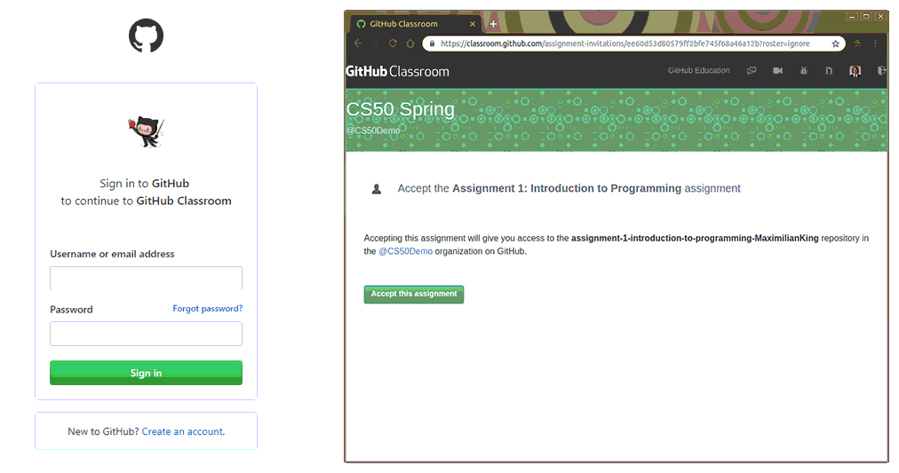

# Getting Started With DATA 1050!
In this lab you'll set up the tools that you will need for this course on your computer so that you can work on projects and labs efficiently throughout the semester. If you run into any trouble, pleasse do not hesitate to reach out to the TAs!

## JupyterLab & Jupyter Notebook

JupyterLab is the next-generation user interface for Project Jupyter. It enables users to use tools such Jupyter Notebook, text editor, terminal all in a flexible, integrated, and extensible manner.


<br>

Luckily, Brown University has developed the [Brown JupyterHub](https://docs.ccv.brown.edu/jupyterhub/) to provide an environment that is designed to run JupyterLab and Jupyter Notebook without the need to install any software or packages. JupyterHub is interacted with completely through a web browser. This service is a collaboration supported by various teams in CIS. 

### Before Getting Started

 Prior to accessing Brown’s JupyterHub, you will need the following:

*  A supported web browser \(Chrome, Firefox, Safari, Microsoft Edge\)
*  Be enrolled in a course at Brown that utilizes JupyterHub \(ask your professor\)
*  Have read through the [Computing Policies Terms of Service Agreement](../computing-policy.md#brown-jupyterhub-terms-and-service-agreement)

### Sign In

 Start using JupyterHub by signing in to your account for your class.

1.  Go to [https://data.jupyter.brown.edu](https://data.jupyter.brown.edu) and click "Sign in with Brown Gmail Login"
2.  Enter your Brown email address and password

Once authenticated, you should automatically be logged in and a JupyterHub server will begin launching. A status bar will appear with detailed information regarding your server startup. Once connected, you should arrive at the JupyterHub home page as seen below. For more information about the menu buttons and their functionality, see the [Interface Overview](https://docs.ccv.brown.edu/jupyterhub/using-your-hub/interface-overview) documentation.

**Note:** Once you have already started a server, future logins will automatically spawn any active notebooks automatically.


## GitHub & GitHub Classroom
GitHub Classroom is a way to distribute coding homework assignments though the use of Git, a powerful tool for version control and remote storage of programming projects. For your work on Brown's JupyterHub, GitHub is the recommended method for saving and storing your active projects as it is not only the industry standard, but you can take your projects with you as the foundation of your programming portfolio.

### Create a GitHub Account
In order to use GitHub classroom, you must first create a GitHub account (if you already have an existing account, you can skip this step). To create an account, go to https://github.com/join and complete the account creation process. We recommend you use an appropriate username is it is publicly visible.

### Join GitHub Classroom
Once you have a GitHub account, you must join your classes corresponding GitHub Classroom organization. To do this, follow the link provided by your instructor's classroom invitation link. This will require you to sign in to your GitHub account, and then you will automatically become linked! **TODO: prvide our classroom link**

## Assignments Workflow

**Prerequisites(only need to be done once):**  Syncing JupyterHub and GitHub:
1. In Brown JupyterHub, create a new **Terminal** from Launcher. 
2. In the terminal type the gitconfig command: `gitconfig -u your_github_username -n your_name -e your@email.com`. Enter your GitHub password when asked.
3. Then, you will get this message: *The authenticity of host 'github.com (192.30.253.113)' can't be established. RSA key fingerprint is (some gibberish). Are you sure you want to continue connecting (yes/no)?* **Type yes and hit Enter.**


**For every assignment with assignment link provided:**
1. Accept GitHub assignment by by clicking on the corresponding assignment link that will be provided when assignment is released.




2. Now you have created the repository for the assignment, you will download the assignment to JupyterHub to start work process. To do this, you will need to get the URL of the GitHub repository you just created: 


3. Open a terminal in Brown JupyterHub's JupyterLab by opening the Git tab on top left.
4. Clone your assignment to the hub using the git clone command `git clone <gitURL>`. Replace <gitURL> with copied URL from Step 2.
    
**Submitting your work:**
Once you have completed your assignment and are ready to turn it in, please follow the following steps from the root of the assignment directory.

1. `git add . ` to add your local changes to staging area.
2. `git commit -m “(your commit message)”` to commit the local changes to local repository.
3. `git push` to push the commited local changes to remote repository.


## Git
Git is one of the most commonly used systems for version control which allows us to manage changes in our code and collaborate with others. We will go more in-depth with Git in our next lab. For now, here are the essential Git commands: 


| Git Command | Description |
|-|-|
| `git clone URL-or-path-to-repo` | Clone a repository. This makes a new folder in the current directory containing the files in the repository in which you can work on the code. |
| `git add`                     | Add the given file to the repository so that it will be tracked by git. Use this when you author a new code file and want to include it in a commit. Alternatively, include `-a` to add all files from your local repo |
| `git commit`                            |  	Finalize the current changes to your code as a commit to your current branch and repo on your local machine. Include `-a` to automatically add changed files that git is already tracking and `-m <message>` to include a message about the commit (otherwise you will be kicked to an editor in which to type out your message).                  |                                                                                                                                                                                                   
| `git pull`                               |  Pull any changes that have happened on the remote server you initially cloned and bring them into your local repository. You will need to have a clean repo so you will probably want to commit first if you have changes (or stash them). <br><br> (**Note**: A `git pull` is a combination of a `git fetch` and a `git merge` which will lead to extra commits of the form `Merge branch 'master' of ....` For a cleaner history, use `git pull --rebase`)             |  
| `git push` | Push whatever commits you have made locally to the remote repository that you cloned previously. You may need to pull first to ensure that you are in sync with the repo. |
| `git log` | View history of commits that you have made. They will be displayed with their unique identifier (a big hex mess like 766f98f32fa...) and their commit message. |

## Text Editor
Throughout the course, it will also be helpful to have a dedicated place to edit your code and program. There are many free text editor available in the market; the one we recommend is Visual Studio Code (or VS Code). You can download it from [here](https://code.visualstudio.com/download).

## Debugging

### `print`
An easy way to debug your Python program is using `print`. A Python `print` function simply display text in the terminal so you can see what’s going on. This is useful for seeing what the values of certain variables are or just seeing where your program is going as an excuse. 


### `%debug` magic

The easiest way to debug a Jupyter notebook is to use the `%debug` magic command. Whenever you encounter an error or exception, just open a new notebook cell, type %debug and run the cell. This will open a command line where you can test your code and inspect all variables right up to the line that threw the error.
Type **“n”** and hit Enter to run the next line of code (The → arrow shows you the current position). Use **“c”** to continue until the next breakpoint. **“q”** quits the debugger and code execution. Here is a practice:


```
# Try running this block of code

output = []
for number in range(1,10):
    output.append(number)
    
if len(output) is not 10:
    raise Exception('Output does not contain numbers 1 to 10')
```


    ---------------------------------------------------------------------------

    Exception                                 Traceback (most recent call last)

    <ipython-input-1-3d246fdaeab4> in <module>
          6 
          7 if len(output) is not 10:
    ----> 8     raise Exception('Output does not contain numbers 1 to 10')
    

    Exception: Output does not contain numbers 1 to 10


```
# Use %debug to find out what is wrong

%debug
```

### Put your answer to above here:

<br>


## Conclusion
To complete this lab, you will need to the clone repository for this lab, download the assignment to Brown JupyterHub, edit this file by answering the above question, commit and then push your changes. That's it! Welcome to DATA 1050!


```

```
